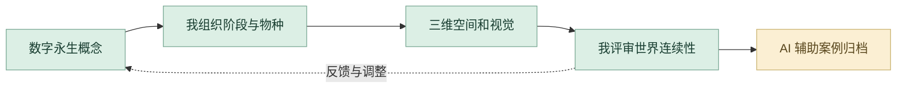

# NO.3 后数字物种

数字永生世界观、三阶段空间设计与物种档案。

**[完整设计案例](https://xiongzhiyuan-portfolio.pages.dev/zh/work/post-digital-species/) · [求职作品总入口](https://github.com/Zhiyuan-Xiong/xiongzhiyuan-portfolio)**

## 项目目标

项目以“数字永生”为核心命题，思考当数字身份与现实身份同等重要时，死亡是否仍然意味着生命的终结。在未来社会中，人类的记忆、情感、行为轨迹与社会关系被持续存储于网络之中，数字身份逐渐成为与现实生命同样重要的存在。肉体会消亡，但数据不会；生命会结束，而记忆仍将继续留存。

## 我的贡献

概念世界观、三维场景与视觉设计

完成阶段：概念设计、三维模型与场景影像

现有产出：未来设定、研究图、三阶段概念模型、数字葬礼流程、物种档案与四段场景影片

## 设计制作与 AI 协作工作流

围绕数字永生建立世界观、三阶段空间与物种档案。我负责概念和三维视觉；本次 AI 协作帮助既有设计的内容复盘与可浏览案例组织。此项目保留资料，但不进入求职主页精选。

| 阶段 | 制作、判断与 AI 协作 |
| --- | --- |
| **1. 建立概念与阶段关系** | 将数字永生转为物种、环境与空间之间的关系，明确三阶段怎样组成连续的世界。世界观是后续视觉与模型的判断基准。 |
| **2. 对照研究和设计资料** | 借助 AI 整理既有世界观、图像和章节资料，比较概念与空间结果是否相互支持。原创观点与阶段关系由我判断。 |
| **3. 完成三维空间和物种表达** | 通过三维场景、物种档案与视觉设计展示不同阶段的结构和氛围。比较尺度、轮廓、材质和空间层次，让同一世界具有连续性。 |
| **4. 我控制视觉一致性** | 检查三阶段的视觉联系以及物种与环境的关系。对概念、造型或信息层级的问题分别回到设计和制作环节调整。 |
| **5. Codex 组织数字案例** | 当前作品集将阶段、空间与物种资料组织为网页案例；AI 辅助排布与内容整理，我核对原项目含义和图像展示。 |
| **6. 保留成果与迭代依据** | 保留世界观、三维场景、物种档案和原案例代码。用可检查的图像与章节说明支持制作过程，不将未记录的原始建模方式改写为 AI 建模。 |

### 审美与专业评审

| 评审维度 | 我的专业判断 |
| --- | --- |
| **概念连续** | 三阶段有清晰的演变关系。 |
| **视觉一致** | 物种、材质与空间来自同一世界。 |
| **资料准确** | 原设计与数字案例相互对应。 |

**过程证据：** [空间与物种资料](media/) · [案例数据](case-data.json) · [数字案例实现](site-source/)

**指令控制：** 先用完整任务说明组织案例结构与视觉基准，再以精准短指令调整阶段递进、尺度、材质与视觉连续，通过实际画面与原作对照验收。

[阅读完整的项目工作流](工作流.md) · [我的 AI 设计方法](https://github.com/Zhiyuan-Xiong/xiongzhiyuan-portfolio/blob/main/docs/AI设计工作流.md)

## 仓库内容

- [media/](media/)：项目公开影像、图像与交互数据。
- [images/](images/)：作品集封面与不同尺寸展示图。
- [site-source/](site-source/)：对应案例文案、页面组件与相关交互实现。
- [case-data.json](case-data.json)：项目目标、职责、章节与产出信息。

## 查看与使用

GitHub 中可直接浏览图像、GIF、文案与实现文件。完整交互与影像观看入口为顶部的在线案例。网页组件的完整构建环境位于 [作品集总仓库](https://github.com/Zhiyuan-Xiong/xiongzhiyuan-portfolio)。

## 署名与使用

作品素材用于个人设计展示。协作项目以案例中的职责说明为准；字体、引擎和第三方资料遵循各自授权。未经许可，不将作品素材用于转载或商业用途。
