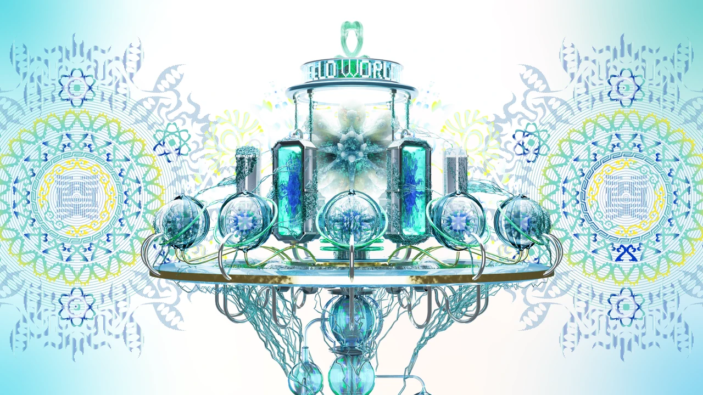

# NO.3 后数字物种

数字永生世界观、三阶段空间设计与物种档案。

**[完整设计案例](https://xiongzhiyuan-portfolio.pages.dev/zh/work/post-digital-species/) · [求职作品总入口](https://github.com/Zhiyuan-Xiong/xiongzhiyuan-portfolio)**

## 项目目标

项目以“数字永生”为核心命题，思考当数字身份与现实身份同等重要时，死亡是否仍然意味着生命的终结。在未来社会中，人类的记忆、情感、行为轨迹与社会关系被持续存储于网络之中，数字身份逐渐成为与现实生命同样重要的存在。肉体会消亡，但数据不会；生命会结束，而记忆仍将继续留存。

## 我的贡献

概念世界观、三维场景与视觉设计

完成阶段：概念设计、三维模型与场景影像

现有产出：未来设定、研究图、三阶段概念模型、数字葬礼流程、物种档案与四段场景影片

## 设计与制作过程

通过背景研究、概念推演、视觉原型和最终图像／影像组织案例。完整章节与个人职责保留在在线案例中；本仓库的案例资料与媒体可用于逐步查看制作证据。

## 仓库内容

- [media/](media/)：项目公开影像、图像与交互数据。
- [images/](images/)：作品集封面与不同尺寸展示图。
- [site-source/](site-source/)：对应案例文案、页面组件与相关交互实现。
- [case-data.json](case-data.json)：项目目标、职责、章节与产出信息。

## 查看与使用

GitHub 中可直接浏览图像、GIF、文案与实现文件。完整交互与影像观看入口为顶部的在线案例。网页组件的完整构建环境位于 [作品集总仓库](https://github.com/Zhiyuan-Xiong/xiongzhiyuan-portfolio)。

## 署名与使用

作品素材用于个人设计展示。协作项目以案例中的职责说明为准；字体、引擎和第三方资料遵循各自授权。未经许可，不将作品素材用于转载或商业用途。
