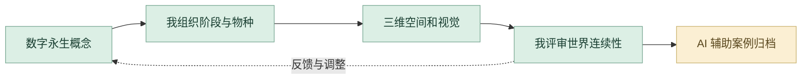

# NO.3 后数字物种｜详细设计与 AI 协作工作流

围绕数字永生建立世界观、三阶段空间与物种档案。我负责概念和三维视觉；本次 AI 协作帮助既有设计的内容复盘与可浏览案例组织。此项目保留资料，但不进入求职主页精选。

## 1. 建立概念与阶段关系

将数字永生转为物种、环境与空间之间的关系，明确三阶段怎样组成连续的世界。世界观是后续视觉与模型的判断基准。

## 2. 对照研究和设计资料

借助 AI 整理既有世界观、图像和章节资料，比较概念与空间结果是否相互支持。原创观点与阶段关系由我判断。

## 3. 完成三维空间和物种表达

通过三维场景、物种档案与视觉设计展示不同阶段的结构和氛围。比较尺度、轮廓、材质和空间层次，让同一世界具有连续性。

## 4. 我控制视觉一致性

检查三阶段的视觉联系以及物种与环境的关系。对概念、造型或信息层级的问题分别回到设计和制作环节调整。

## 5. Codex 组织数字案例

当前作品集将阶段、空间与物种资料组织为网页案例；AI 辅助排布与内容整理，我核对原项目含义和图像展示。

## 6. 保留成果与迭代依据

保留世界观、三维场景、物种档案和原案例代码。用可检查的图像与章节说明支持制作过程，不将未记录的原始建模方式改写为 AI 建模。

## 审美与专业评审

| 评审维度 | 我的专业判断 |
| --- | --- |
| **概念连续** | 三阶段有清晰的演变关系。 |
| **视觉一致** | 物种、材质与空间来自同一世界。 |
| **资料准确** | 原设计与数字案例相互对应。 |

## 过程证据

[空间与物种资料](media/) · [案例数据](case-data.json) · [数字案例实现](site-source/)

[项目原说明](README.md) · [完整 AI 方法](https://github.com/Zhiyuan-Xiong/xiongzhiyuan-portfolio/blob/main/docs/AI设计工作流.md)
